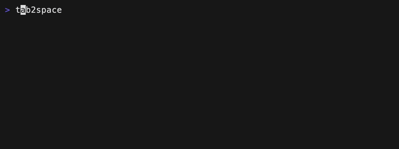

# demand

[
](https://crates.io/crates/demand)
[](https://docs.rs/demand)
[](./LICENSE)
[](https://github.com/jdx/demand/actions/workflows/test.yml)
[](http://github.com/jdx/demand/issues)

A prompt library for Rust. Based on [huh? for Go](https://github.com/charmbracelet/huh). Maintained by [@jdx](https://github.com/jdx) and [@roele](https://github.com/roele).

## Input

* Single-line text input with variable prompt and placeholder
* Auto-complete suggestions with `TAB`
* Validate input with a custom closure

Run example with [`cargo run --example input`](./examples/input.rs).


```rust
use demand::Input;

fn main() {
    let notempty_minlen = |s: &str| {
        if s.is_empty() {
            return Err("Name cannot be empty");
        }
        if s.len() < 8 {
            return Err("Name must be at least 8 characters");
        }
        Ok(())
    };

    let t = Input::new("What's your name?")
        .description("We'll use this to personalize your experience.")
        .placeholder("Enter your name")
        .prompt("Name: ")
        .suggestions(vec![
            "Adam Grant",
            "Danielle Steel",
            "Eveline Widmer-Schlumpf",
            "Robert De Niro",
            "Ronaldo Rodrigues de Jesus",
            "Sarah Michelle Gellar",
            "Yael Naim",
            "Zack Snyder",
        ])
        .validation(notempty_minlen);
    let i = t.run().expect("error running input");
}
```

### Password

Run example with [`cargo run --example input-password`](./examples/input-password.rs).


```rust
use demand::Input;

fn main() {
    let t = Input::new("Set a password")
        .placeholder("Enter password")
        .prompt("Password: ")
        .password(true);
    let i = t.run().expect("error running input");
}
```

## Select

Select from a list of options.

Run example with [`cargo run --example select`](./examples/select.rs).


```rust
use demand::{DemandOption, Select};

fn main() {
    let ms = Select::new("Toppings")
        .description("Select your topping")
        .filterable(true)
        .option(DemandOption::new("Lettuce"))
        .option(DemandOption::new("Tomatoes"))
        .option(DemandOption::new("Charm Sauce"))
        .option(DemandOption::new("Jalapenos").label("Jalapeños"))
        .option(DemandOption::new("Cheese"))
        .option(DemandOption::new("Vegan Cheese"))
        .option(DemandOption::new("Nutella"));
    ms.run().expect("error running select");
}
```

## Multiselect

Select multiple options from a list.
Run example with [`cargo run --example multiselect`](./examples/multiselect.rs).


```rust
use demand::{DemandOption, MultiSelect};

fn main() {
    let ms = MultiSelect::new("Toppings")
        .description("Select your toppings")
        .min(1)
        .max(4)
        .filterable(true)
        .option(DemandOption::new("Lettuce").selected(true))
        .option(DemandOption::new("Tomatoes").selected(true))
        .option(DemandOption::new("Charm Sauce"))
        .option(DemandOption::new("Jalapenos").label("Jalapeños"))
        .option(DemandOption::new("Cheese"))
        .option(DemandOption::new("Vegan Cheese"))
        .option(DemandOption::new("Nutella"));
    ms.run().expect("error running multi select");
}
```

## Confirm

Confirm a question with a yes or no.
Run example with [`cargo run --example confirm`](./examples/confirm.rs).


```rust
use demand::Confirm;

fn main() {
    let ms = Confirm::new("Are you sure?")
        .affirmative("Yes!")
        .negative("No.");
    let yes = ms.run().expect("error running confirm");
}
```

## Dialog

Show a dialog with multiple buttons.
Run example with [`cargo run --example dialog`](./examples/dialog.rs).


```rust
use demand::{Dialog, DialogButton};

fn main() {
    let ms = Dialog::new("Are you sure?")
        .description("This will do a thing.")
        .buttons(vec![
            DialogButton::new("Ok"),
            DialogButton::new("Not sure"),
            DialogButton::new("Cancel"),
        ])
        .selected_button(1);
    ms.run().expect("error running confirm");
}
```

## Spinner

Spinners are used to indicate that a process is running.
Run example with [`cargo run --example spinner`](./examples/spinner.rs).


```rust
use std::{thread::sleep, time::Duration};

use demand::{Spinner, SpinnerStyle};

fn main() {
    Spinner::new("Loading Data...")
        .style(SpinnerStyle::line())
        .run(|| {
            sleep(Duration::from_secs(2));
        })
        .expect("error running spinner");
}
```

## Themes

Supply your own custom theme or choose from one of the predefined themes:

Derive a custom theme from the default theme.

```rust
let theme = Theme {
    selected_prefix: String::from(" •"),
    selected_prefix_fg: Theme::color_rgb(2, 191, 135),
    unselected_prefix: String::from("  "),
    ..Theme::default()
};

Input::new("What's your e-mail?")
        .description("Please enter your e-mail address.")
        .placeholder("name@domain.com")
        .theme(&theme)
        .run()
        .expect("error running input")?;
```

### Base 16


### Charm

Default if colors are enabled in the console.


### Catppuccin



### Dracula


### New

Default if colors are NOT enabled in the console.


## "demand"

The name of this library is inspired by a great [mistranslation](https://www.bbc.com/culture/article/20150202-the-greatest-mistranslations-ever)
that soured US-French relations in 1830. In French, the verb "demander" means "to ask".
