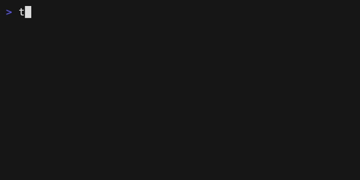

# demand

[
](https://crates.io/crates/demand)
[](https://docs.rs/demand)
[](./LICENSE)
[](https://github.com/jdx/demand/actions/workflows/test.yml)
[](http://github.com/jdx/demand/issues)

A prompt library for Rust. Based on [huh? for Go](https://github.com/charmbracelet/huh).

## Input

Single-line text input.

Run example with [`cargo run --example input`](./examples/input.rs).


```rust
use demand::Input;

fn main() {
    let t = Input::new("What's your name?")
        .description("We'll use this to personalize your experience.")
        .placeholder("Enter your name")
        .prompt("Name: ");
    let i = t.run().expect("error running input");
    println!("Input: {}", i);
}
```

Run example with [`cargo run --example input-password`](./examples/input-password.rs).


```rust
use demand::Input;

fn main() {
    let t = Input::new("Set a password")
        .placeholder("Enter password")
        .prompt("Password: ")
        .password(true);
    let i = t.run().expect("error running input");
    println!("Password: {}", i);
}
```

## Text

Multi-line text input.

TODO

## Select

Select from a list of options.

Run example with [`cargo run --example select`](./examples/select.rs).


```rust
use demand::{DemandOption, Select};

fn main() {
    let ms = Select::new("Toppings")
        .description("Select your topping")
        .filterable(true)
        .option(DemandOption::new("Lettuce"))
        .option(DemandOption::new("Tomatoes"))
        .option(DemandOption::new("Charm Sauce"))
        .option(DemandOption::new("Jalapenos").label("Jalapeños"))
        .option(DemandOption::new("Cheese"))
        .option(DemandOption::new("Vegan Cheese"))
        .option(DemandOption::new("Nutella"));
    ms.run().expect("error running select");
}
```

## Multiselect

Select multiple options from a list.
Run example with [`cargo run --example multiselect`](./examples/multiselect.rs).


```rust
use demand::{DemandOption, MultiSelect};

fn main() {
    let ms = MultiSelect::new("Toppings")
        .description("Select your toppings")
        .min(1)
        .max(4)
        .filterable(true)
        .option(DemandOption::new("Lettuce").selected(true))
        .option(DemandOption::new("Tomatoes").selected(true))
        .option(DemandOption::new("Charm Sauce"))
        .option(DemandOption::new("Jalapenos").label("Jalapeños"))
        .option(DemandOption::new("Cheese"))
        .option(DemandOption::new("Vegan Cheese"))
        .option(DemandOption::new("Nutella"));
    ms.run().expect("error running multi select");
}
```

## Confirm

Confirm a question with a yes or no.
Run example with [`cargo run --example confirm`](./examples/confirm.rs).


```rust
use demand::Confirm;

fn main() {
    let ms = Confirm::new("Are you sure?")
        .affirmative("Yes!")
        .negative("No.");
    let yes = ms.run().expect("error running confirm");
    println!("yes: {}", yes);
}
```

## Spinner

Spinners are used to indicate that a process is running.
Run example with [`cargo run --example spinner`](./examples/spinner.rs).



```rust
use std::{thread::sleep, time::Duration};

use demand::{Spinner, SpinnerStyle};

fn main() {
    Spinner::new("Loading Data...")
        .style(SpinnerStyle::line())
        .run(|| {
            sleep(Duration::from_secs(2));
        })
        .expect("error running spinner");
    println!("Done!");
}
```
